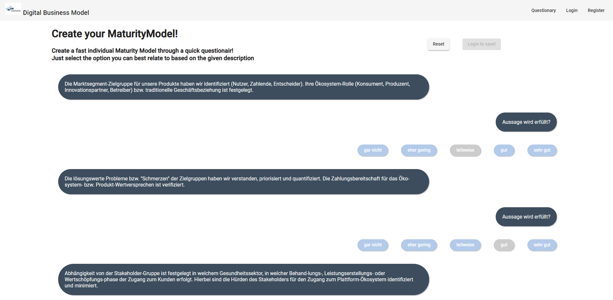
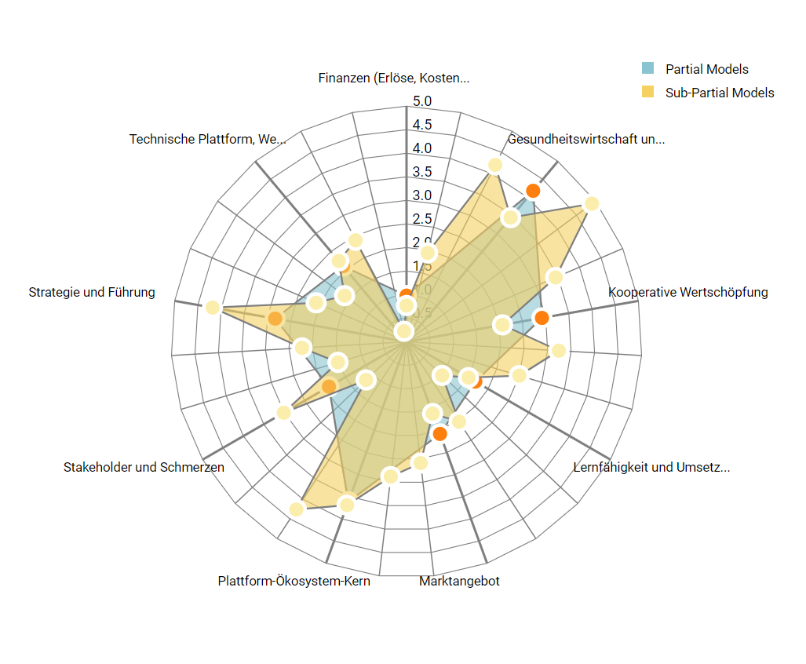

# Conino-BMA-Backend

This project is a Business-Model-Analysis (BMA) tool and helps to develop and evaluate your current business-model in public health care. This project is part of the conino-venture. This repository is all about the back-end-part of the project. The front-end-part can be found [here](https://github.com/FlorianTh2/Conino-BMA).






## Prerequisites
- yarn
- Node v12+
- postgres-db with the credentials defined like in src/ormconfig.ts

## Getting Started

- Install dependencies
```
    $ yarn install
```
- Build project
```
    $ yarn build
```

- Start project
```
    $ yarn start
```

## Documentation: Modules
- src/
    - contracts/
        - inludes all files regarding the graphql-interface (mostly incoming data-classes)
        - separeted into requests + responses
    - database/
        - contains database-entities and migrations
        - path is specified in ormconfig.ts and therefore fixed
    - dataLoaders/
        - the given application includes a graphql-interface
        - graphql is known for the "n+1-problem"
        - to address this issue this project features dataloaders
    - installers/
        - installers are introduces to install project dependencies like apollo or typeorm
        - these installers are called during starting-process
    - resolvers/
        - contains modules regarding top-level and sub-level-resolvers
        - the corresponding schema can be inspected at ./src/schema/schema.graphql
    - schema/
        - this folder comprises all given schemas (1 at the moment)
    - seeding/
        - seeding is an important aspect of the given application since the official model has to be injected into the application
        - for the process of seeding typeorm-seeding- with the faker-library are used
            - data: stores the used data (with the model)
            - factories: introduce a generic way to create database-entities
            - seeds: the implementation of the actual seeding-process
    - services/
        - mostly an experimental-folder since this project does not feature a dependency-injection-approch
    - shield/
        - to protect the graphql-interface, graphql-shield is used
        - graphql-shield-rules and -permissions are stored here
    - types/
        - includes some types for typescript
    - utils/
        - includes some outsources functions


## Important commands

- Start nodemon
```
    $ yarn nodemon
```

- Start the transpiles project for production
```
    $ yarn start:prod
```

- Lint the project
```
    $ yarn lint
```

- Create and run db-migration
```
    $ yarn typeorm migration:generate -- -n "database init"
    $ typeorm migration:run
```

- Seed project from scratch (delete data + drop db-schema + run migrations + seed)
```
    $ yarn db:setup
```

## Build with
- yarn v1.22
- node v12+
- typescript v4
- apollo-server v2.21
- dataloader v2
- express v4.17
- graphql v15.5
- graphql-middleware v6.0
- graphql-shield v7.5
- graphql-tools v7
- jsonwebtoken v8.5
- pg v8.5
- typeorm v0.2.31
- typeorm-seeding v1.6.1

## Acknoledgements
- Thanks to my supervisor Mr. T.Knape@Charité Berlin for the help with this student project
